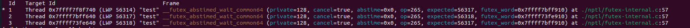
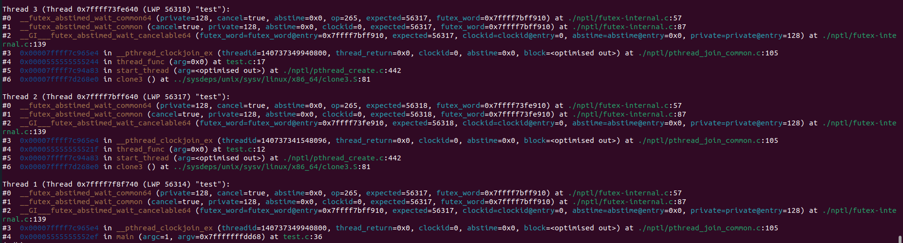
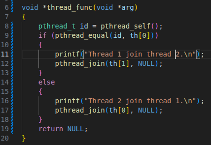

# OVERVIEW

Hãy đặt hai công cụ cạnh nhau:

```text
                 User space
┌─────────────────────────────────────────┐
│                 Process                 │
│                                         │
│  C code     pthread     malloc     IPC  │
└───────────────────┬─────────────────────┘
                    │
                 syscall
                    │
                    ▼
┌─────────────────────────────────────────┐
│              Linux kernel               │
│                                         │
│ files / processes / memory / network    │
│ scheduler / signals / devices / IPC     │
└─────────────────────────────────────────┘
```

GDB chủ yếu quan sát:

```text
process
├── variables
├── stack
├── registers
├── memory
├── threads
└── instructions
```

strace chủ yếu quan sát:

```text
process
   │
   ├── openat()
   ├── read()
   ├── write()
   ├── mmap()
   ├── fork()
   ├── execve()
   ├── wait4()
   ├── socket()
   ├── connect()
   ├── futex()
   ├── poll()
   └── signals
```

# 1. GDB

**GDB does not run the program for you in a special way.**

It creates or attaches to a process and then uses Linux debugging mechanisms to:

- run the process
- stop the process
- read registers
- read memory
- set breakpoints
- monitor memory
- retrieve the stack
- debug threads/processes

To use GBD to check the program, firstly, we must compile the program using this command:

```bash
gcc -g -O0 program.c -o program
```

|Argument|Effect|
|:---|:---|
|`-g`|If I remove `-g` from this command, the binary file primarily contains machine code, CPU does not know the function or variable names. Using `-g` parameter allows us to see the **debug informations**.|
|`-O0`|When compile, the compiler can optimize the variable. If we want to source code run correspond to the execution process, use `-O0`.|

Example:

```c
int x = 10;
int y = 20;
int z = x + y;
```

`-g` keep the debug informations and `-O0` does not optimize `z` variable to 30.

To run with `gbd`, use the command bellow:

```bash
gdb ./test
```

We will see: *(gdb)*. This is **gdb prompt.**

Use `run` or `r` to run the program normally then finished.

```gdb
(gdb) run
```

*Some gdb prompt is commonly useed:*

|Prompt|Effect|
|:---|:---|
|run (r)|run the program|
|break (p)|set a break point with function name|
|delete|delete all breakpoint|
|disable 2|temporarily disable breakpoint 2|
|enable 2|enable breakpoint 2|
|tbreak|set a temporary breakpoint|
|next (n)|perform a step at the source code level|
|step (s)|perform a step that can enter into the function|
|print (p)|see the value of variable or return function called in context of current function|
|info locals|see all local variables of current stack frame or those matching REGEXPs|
|backtrace (bt)|see the function that gdb current stopped|
|finish|jump to return function|
|quit (q)|exit from gdb|

## Condition breakpoint

Example we have a function:

```c
    for (int i = 0; i < 100; i++)
    {
        printf("i = %d\n", i);
    }
```

And we want to set a breakpoint at line `printf`, everytime the program run to this line, it will be stopped. Accoding to the example above, it will be stopped 100 times and we don't want to this behave. We want to the program stop when `i = 50`. How do it?

We use:

```text
break 44 if i == 50
```

Where `44` is the number of the line we want to break, `if i == 50` is the condition of breakpoint.

If the breakpoint already existed, we can add condition to it by using:

```text
    condition 2 i == 50
```

`2` is the number of the breakpoint that we want to add condition.

## Ignore breakpoint

Example we have a program call a function 3 times:

```c
int  foo()
{
}

int main()
{
    foo();
    foo();
    foo();

    return 0;
}
```

We set a breakpoint at `foo` function and it can be called 3 times. We want to skip the first two times and want to stop at third, we can use:

```text
ignore 1 2
```

```text
`1`           | is the number of breakpoint.
`2`           | is the number of times we want to skip.
```

## See source code

```text
list

or

list 41
```

where `41` is the number of the line we want to see source code.

Example when we use `list 41` command to see the source code around line 41:

```c
(gdb) list 41
36     int result = a + b;
37     return result;
38 }
39 
40 int main(int argc, char *argv[])
41 {
42     for (int i = 0; i < 10; i++)
43     {
44         printf("i = %d\n", i);
45     }
```

## Watchpoint

`breakpoint` mean that the program running to the line marked by breakpoint will stop there.

Unlike with `breakpoint`, `watchpoint` mean that the program will stop when the value of variable changed.

Example:

```c
int main(int argc, char *argv[])
{
    int b = 10;
    subtract(&b);
    return 0;
}
```

I set a breakpoint at `main` then run the program, it will stop at main function.  
Then I set a watchpoint by using `watch b` to check for changes of `b`. When the value of `b` was changed, the program will stop immediately.

```c
Hardware watchpoint 5: b

Old value = 0
New value = 10
main (argc=1, argv=0x7fffffffdd68) at test.c:45
```

And furthermore, we can see what program has changed the value of `b`. In this case, it is `main` function.

**Some type of `watch`**

||Description|
|:---|:---|
|watch|stop if the value changed|
|rwatch|stop if it is read|
|awatch|stop if it is accessed|

**watch \*pointer**

Example:

```c
int value = 100;
int *p = &value;

*p = 200;
```

We can use `watch *p` to track the memory that `p` point to.

**watch with struct**

Example:

```c
struct Data
{
    int counter;
    int state;
};

struct Data data;
```

We can track the changes of variables in struct by using: `watch data.counter`.

## View raw memory

For example, we have a variable `int value = 999;`, we want to see the memory of it by using:

```gdb
x/4xb &value
```

The result is:

```text
0xe7 0x03 0x00 0x00
```

Where:

- `x` is stands for *examine memory*
- 1 = the number of unit want to read
- x = format
- b = unit size

`x/4xb &value` mean we want to read 4 byte at the address of `value` in hexadecimal format.

Commonly used unit sizes:

| Symbol | Mean |
| ------- | -------------------- |
| `b` | byte = 1 byte |
| `h` | halfword = 2 bytes |
| `w` | word = 4 bytes |
| `g` | giant word = 8 bytes |

Some important formats:

| Format | Mean             |
| ------ | ------------------- |
| `x`    | hexadecimal         |
| `d`    | signed decimal      |
| `u`    | unsigned decimal    |
| `o`    | octal               |
| `t`    | binary              |
| `c`    | character           |
| `s`    | string              |
| `i`    | machine instruction |

## Debug with `coredump file`

First we must check the coredump file:

```bash
ulimit -c
```

If the result is `0`, it means we does not turn on the coredump.

If the result is `unlimited`, the coredump has already started.

To turn on coredumo, we can use `ulimit -c unlimited`.

Compile the program and use `coredumpctl debug filename` to run it with `gdb`.

```bash
sudo sysctl -w kernel.core_pattern='core.%e.%p'
```

## See registers

```gdb
info registers
```

**See instruction at RIP**

Supposed that we use `info registers rip` to see the address of `rip` and receive:

```text
rip            0x58872295615d
```

We can see instruction:

```gdb
x/i $rip
```

```text
=> 0x58872295615d <level3+20>:  movl   $0x64,(%rax)
```

## GDB with thread

**Compile and run it with gdb. When the program is running, use `Ctrl + C` to stop to see the informations of threads.**

|Prompt|Effect|
|:---|:---|
|info threads|see the informations of threads|
|thread [number]|switch to another thread|
|thread apply all backtrace|see all backtrace of threads|

Example Dealock with two threads:

```c
pthread_t th[2];

void *thread_func(void *arg)
{
    pthread_t id = pthread_self();
    if (pthread_equal(id, th[0]))
    {
        printf("Thread 1 join thread 2.\n");
        pthread_join(th[1], NULL);
    }
    else
    {
        printf("Thread 2 join thread 1.\n");
        pthread_join(th[0], NULL);
    }
    return NULL;
}

int main(int argc, char *argv[])
{
    /* create threads */
    if (pthread_create(&th[0], NULL, thread_func, NULL) != 0)
    {
        printf("Create thread 1 fail.\n");
        return -1;
    }

    if (pthread_create(&th[1], NULL, thread_func, NULL) != 0)
    {
        printf("Create thread 2 fail.\n");
        return -1;
    }

    /* join threads */
    if (pthread_join(th[0], NULL))
    {
        printf("Join thread 1 fail.\n");
        return -1;
    }
    if (pthread_join(th[1], NULL))
    {
        printf("Join thread 2 fail.\n");
        return -1;
    }
    return 0;
}
```

I reproduce a scenario where two threads joined each other, resulting in a hang.

Then I use gdb to check where the process is hanging.

First I run it with gdb:

```gdb
(gdb) run
Starting program: /home/hungubuntu/Vim_C_code/session_6/test 
[Thread debugging using libthread_db enabled]
Using host libthread_db library "/lib/x86_64-linux-gnu/libthread_db.so.1".
[New Thread 0x7ffff7bff640 (LWP 56317)]
Thread 1 join thread 2.
[New Thread 0x7ffff73fe640 (LWP 56318)]
Thread 2 join thread 1.
```

Okey, I see the output of the program and realize that two thread is joining each other.

Then to stop the program ,I use `Ctrl + C`.

Second, I use `info threads` to see infomation of threads:



Finally, I use `thread apply all backtrace` to see all function that threads have stopped.



As we can see in the picture:

- thread 1 is stopped at main, line 36
- thread 2 is stopped at thread_func, line 12
- thread 3 is stopped at thread_func, line 17

Then I check the source code C:



It has been concluded that the cause of the hang is the `pthread_join` function in the two threads.

## GDB with multiple process

|Prompt|Effect|
|:---|:---|
|set follow-fork-mode parent|GDB follow to parent|
|set follow-fork-mode child|GDB follow to child|
|set detach-on-fork off|not detach the other process from GDB|
|set detach-on-fork on|detach the other process from GDB|

# 2. Strace

## What is strace and why we need it?

If the ***GDB*** help we see inside the program, ***strace*** help we know how the process communicate with Linux Kernel.

## Where is the **strace**?

```text
             strace
               │
               │ observe
               ▼
Process ── syscall ──> Kernel
          ↑       │
          └───────┘
```

Example:

```c
int main(void)
{
    int fd = open("abc.txt", O_RDONLY);

    if (fd == -1)
    {
        perror("open");
        return 1;
    }

    close(fd);

    return 0;
}
```

Compile `gcc -g -O0 test.c -o test` and run it with strace:

```bash
strace ./test 
```

We can see the very long result, but we should focus some main lines:

```text
openat(AT_FDCWD, "abc.txt", O_RDONLY)   = -1 ENOENT (No such file or directory)
dup(2)                                  = 3
fcntl(3, F_GETFL)                       = 0x80002 (flags O_RDWR|O_CLOEXEC)
getrandom("\xec\xe5\x1e\x38\xcb\xe6\x00\x13", 8, GRND_NONBLOCK) = 8
brk(NULL)                               = 0x60d2f7fb8000
brk(0x60d2f7fd9000)                     = 0x60d2f7fd9000
newfstatat(3, "", {st_mode=S_IFCHR|0620, st_rdev=makedev(0x88, 0x1), ...}, AT_EMPTY_PATH) = 0
write(3, "open: No such file or directory\n", 32open: No such file or directory
) = 32
close(3)                                = 0
exit_group(1)                           = ?
```

The results show that the program encountered an error because it could not find the file to be opened.

## Filter strace

We can filter the output using filters passed to the trace command:

```bash
strace -e trace=file ./hello
```

Some filter we can use:

| Filter    | Trace                    |
| --------- | --------------------------- |
| `file`    | file operations             |
| `process` | process creation/management |
| `network` | socket/network              |
| `signal`  | signals                     |
| `memory`  | memory-related syscalls     |
| `ipc`     | IPC-related operations      |
| `desc`    | file descriptors            |

## Write to log file

The output of strace is typically long. We can write it to a file.

```bash
strace -o trace.log ./program
```

Then use `cat trace.log` or `less trace.log`.

## Focus `fork` process

Use `strace -f ./test` to follow process that is created.

# 3. Valgrind

**What is Valgrind?**

Valgrind is a frame work to check the memory of program.

Some error about memory:

| Bug                 | Mean                         |
| ------------------- | ------------------------------- |
| Invalid read        | Read the memory region that does not permitted    |
| Invalid write       | Write to the memory region that does not permitted    |
| Use-after-free      | Use memory after `free`        |
| Double free         | Double `free`    |
| Memory leak         | Call `malloc` but not call `free` |
| Uninitialized value | Use the value that does not initialized |

## Check memory Invalid

Example:

```c
    int *p = malloc(5 * sizeof(int));

    for (int i = 0; i <= 5; i++)
    {
        p[i] = i;
    }
```

Compile and run wtih:

```bash
Valgrind ./test
```

We will receive the result:

```text
==19492== Invalid write of size 4
==19492==    at 0x1091C3: main (test.c:68)
==19492==  Address 0x4ab0054 is 0 bytes after a block of size 20 alloc'd
==19492==    at 0x4848899: malloc (in /usr/libexec/valgrind/vgpreload_memcheck-amd64-linux.so)
==19492==    by 0x10919E: main (test.c:64)
```

Focusing on the first three lines, the notification indicates that we are writing to an invalid memory area at line 68 of the file `test.c`. The reason is that the address we are attempting to write to lies outside the memory region allocated by the `malloc` function (5 * sizeof(int) is 20 bytes).

## Leck memory

Command:

```bash
valgrind --leak-check=full ./test
```

Example:

```c
    int *p = malloc(sizeof(int));

    *p = 100;
```

```text
==37927== HEAP SUMMARY:
==37927==     in use at exit: 4 bytes in 1 blocks
==37927==   total heap usage: 1 allocs, 0 frees, 4 bytes allocated
==37927== 
==37927== LEAK SUMMARY:
==37927==    definitely lost: 4 bytes in 1 blocks
==37927==    indirectly lost: 0 bytes in 0 blocks
==37927==      possibly lost: 0 bytes in 0 blocks
==37927==    still reachable: 0 bytes in 0 blocks
==37927==         suppressed: 0 bytes in 0 blocks
==37927== Rerun with --leak-check=full to see details of leaked memory
```

As we can see at `HEAP SUMARY`, we have 4 bytes in use after the program have already exited.

And at `LEAK MEMORY`, we have 4 bytes at definitely lost field.

## Use after free

Example:

```c
    int *p = malloc(sizeof(int));

    *p = 100;

    free(p);

    *p = 20;
```

```text
==40248== Invalid write of size 4
==40248==    at 0x10919D: main (test.c:70)
==40248==  Address 0x4ab0040 is 0 bytes inside a block of size 4 free'd
==40248==    at 0x484B27F: free (in /usr/libexec/valgrind/vgpreload_memcheck-amd64-linux.so)
==40248==    by 0x109198: main (test.c:67)
==40248==  Block was alloc'd at
==40248==    at 0x4848899: malloc (in /usr/libexec/valgrind/vgpreload_memcheck-amd64-linux.so)
==40248==    by 0x10917E: main (test.c:63)
```

We attempt to access to the memory that have been released, the **Valgrind** show us the some infomations:

- Location of Invalid write operation at 0x10919D: main (test.c:70).
- Location of the memory was released at main (test.c:67).
- Location of the memory was created at main (test.c:63) by called `malloc`.

## Uninitialized memory

Command:

```bash
valgrind --track-origins=yes ./test
```

Example:

```c
    int x;

    printf("x = %d\n", x);

    return 0;
```

```text
==47680== Conditional jump or move depends on uninitialised value(s)
==47680==    at 0x48FAA96: __vfprintf_internal (vfprintf-internal.c:1516)
==47680==    by 0x48E479E: printf (printf.c:33)
==47680==    by 0x10916D: main (test.c:66)
==47680==  Uninitialised value was created by a stack allocation
==47680==    at 0x109149: main (test.c:63)
```

We can see that an uninitialized value is used at line 66 in the `main` function, and it originates from a stack allocation at line 63 of the `main` function.
